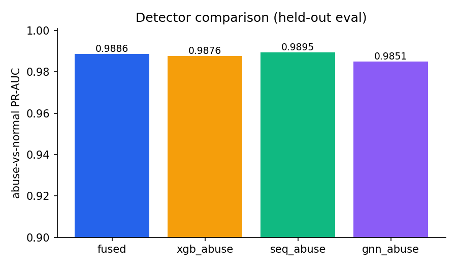
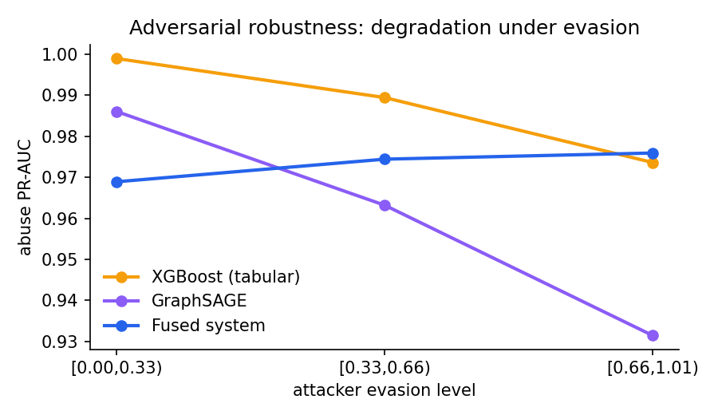
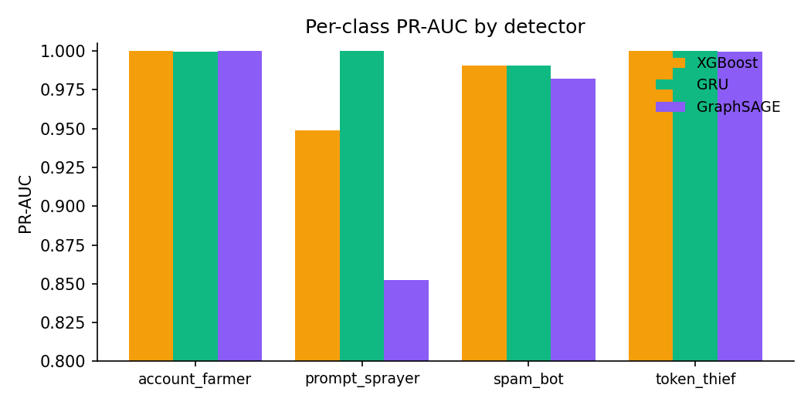
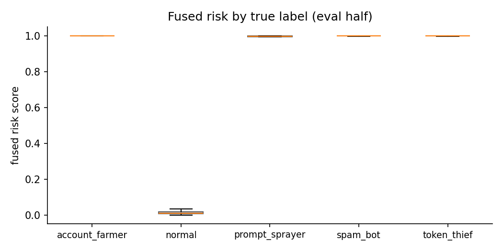
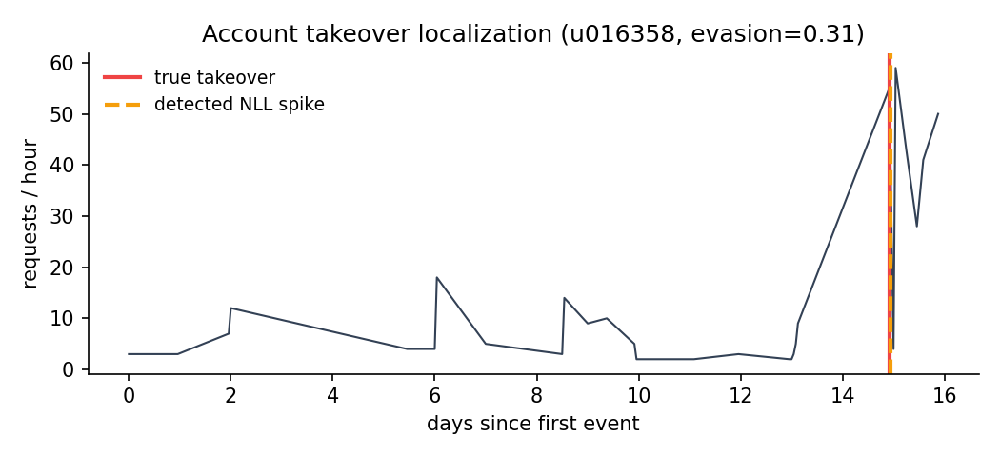

# Run report — `data/run2`
_generated 2026-06-11 23:34 UTC_

## Headline

| detector | abuse PR-AUC |
|---|---|
| fused | 0.9886 |
| xgb_abuse | 0.9876 |
| seq_abuse | 0.9895 |
| gnn_abuse | 0.9851 |

Expected cost: **705.0** vs do-nothing 8,775.0 (**92.0% reduction**)

### Enforcement tiers

| tier | n | abusive | precision |
|---|---|---|---|
| suspend | 223 | 219 | 0.982 |
| challenge | 43 | 15 | 0.349 |
| rate_limit | 109 | 0 | 0.000 |
| monitor | 2625 | 1 | 0.000 |

## XGBoost baseline

| class | PR-AUC |
|---|---|
| account_farmer | 0.9999 |
| normal | 0.9996 |
| prompt_sprayer | 0.9486 |
| spam_bot | 0.9908 |
| token_thief | 1.0000 |

## Sequence model

| class | PR-AUC |
|---|---|
| account_farmer | 0.9997 |
| normal | 0.9998 |
| prompt_sprayer | 1.0000 |
| spam_bot | 0.9906 |
| token_thief | 1.0000 |

ATO anomaly AUC: **0.91**, median localization 41.77h

## GraphSAGE

| class | PR-AUC |
|---|---|
| account_farmer | 1.0000 |
| normal | 0.9979 |
| prompt_sprayer | 0.8524 |
| spam_bot | 0.9819 |
| token_thief | 0.9997 |

## Ring mining (unsupervised)

- flagged 950 accounts, precision 0.792, recall 0.752 (IP fanout cap 10)

## Spray detection (embeddings)

- cluster ground-truth purity 96.00%, precision 0.723
- recall: prompt_sprayer 99.50%, spam_bot 72.67%, normal 0.00%, prompt_sprayer_slow(e>0.6) 98.77%

## Figures

